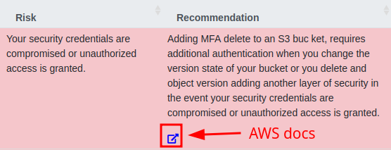

# Exercise 1: Usage and Customization of Prowler

To complete the first exercise, I followed the [Getting Started](https://docs.prowler.com/projects/prowler-open-source/en/latest/) page in the [Prolwer documentation](https://docs.prowler.com/).


## Work done

Since I chose to use Docker, I needed to inject the AWS credentials into the container. To do this, I created a copy of `.env.template` named `.env`:
``` bash
cp .env.template .env
```

I  then copied the required variables from the output of the following command into the new `.env` file:
```bash
aws sts get-session-token
```

Next, I ran the following commands and waited for Prowler to complete the scan:
```bash
mkdir output
docker compose up
```


## Analysis

To perform the analysis, I used the HTML output, which allowed me to filter the results dynamically and take screenshots.

The scan returned a large number of security issues, most of them related to regions and products I don't use.


I primarily use AWS to backup my home server's home automation configuration to S3, so the only service I use is S3 in the `eu-west-1` region. Therefore, my **first remediation step** will be to deactivate the unused products and regions. With that filter applied, the results were much more manageable for a case like mine.


This left only nine failed checks, all of which were of medium or low severity.


Since there were only a few, my **next remediation steps** will be to read the _risk_ and _recommendation_ for each one and follow the corresponding guidance in the AWS documentation.



Finally, I did some cleanup before committing the necessary files to the repository:
``` bash
mkdir report
mv output/prowler-output-383501264326-20250721180251.ocsf.json report/output.json
rm -r output
```

The final [OCSF JSON output](./report/output.json) file is available in the `report` directory.


## Notes

I found a few issues while working on this exercise:

1. The Docker image namespace in the documentation is [`toniblyx`](https://hub.docker.com/u/toniblyx), but a [`prowlercloud`](https://hub.docker.com/u/prowlercloud) namespace also exists, and [both images](https://hub.docker.com/layers/toniblyx/prowler/5.9.1/images/sha256-99b512c8d61aa13d720a6075c2c2677768c88b4d5642df1320d7b32f5aef2197) appear to be [the same](https://hub.docker.com/layers/prowlercloud/prowler/5.9.1/images/sha256-99b512c8d61aa13d720a6075c2c2677768c88b4d5642df1320d7b32f5aef2197). Also, [`toniblyx/prowler`](https://hub.docker.com/r/toniblyx/prowler) has an overview/REAMDE, while [`prowlercloud/prowler`](https://hub.docker.com/r/prowlercloud/prowler) doesn't.
2. In most Docker installations, the output directory must be created beforehand, otherwise, Docker will create it as the root user. The container will then try to write its contents as [user `1000`](https://github.com/prowler-cloud/prowler/blob/5.9.1/Dockerfile#L32) and won't have the required permissions.
